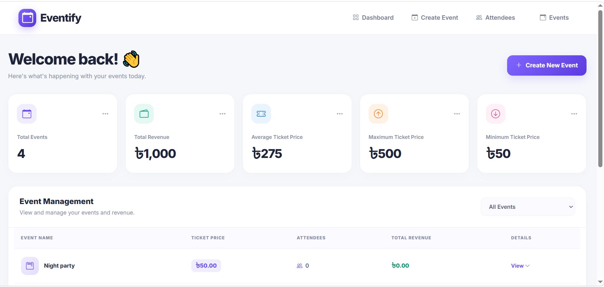
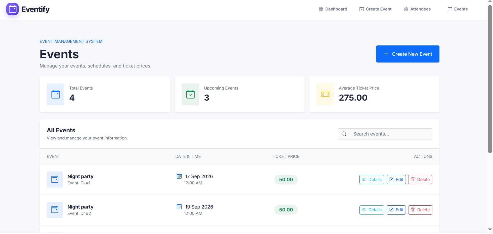
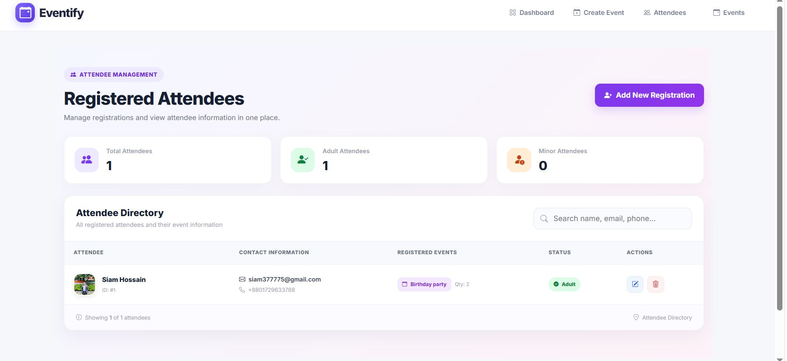
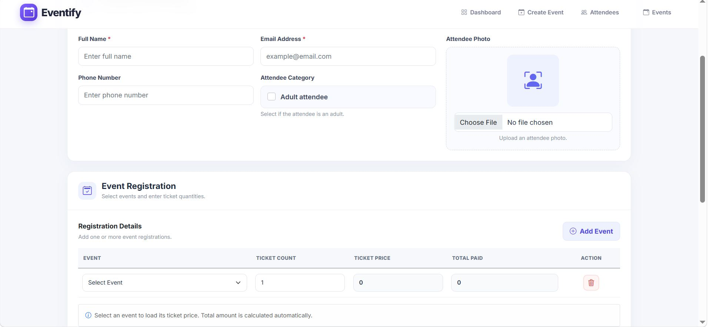

# Event Management System

A web-based Event Management System built with ASP.NET Core MVC for managing events, attendees, and event registrations in one application.

## Project Overview

The system provides a centralized platform for organizing event information, maintaining attendee records, and managing event registrations. It uses the Model-View-Controller (MVC) architecture to separate application logic, data, and user interface components.

## Main Modules

- Event management
- Attendee management
- Event registration management
- Database operations
- Event and attendee information management

## Technology Stack

- **Framework:** ASP.NET Core MVC
- **Language:** C#
- **ORM:** Entity Framework Core
- **Database:** Microsoft SQL Server
- **Views/UI:** Razor Views
- **Frontend:** HTML, CSS, Bootstrap, JavaScript
- **IDE:** Microsoft Visual Studio

## Architecture

```text
              Users
                |
                v
       ASP.NET Core MVC
                |
       -------------------
       |        |        |
   Models   Views   Controllers
       |        |        |
       -------------------
                |
                v
       Entity Framework Core
                |
                v
        Microsoft SQL Server
```

## High-Level Workflow

```text
Create and Manage Events
          |
          v
Manage Attendee Information
          |
          v
Register Attendees for Events
          |
          v
Store and Manage Registration Data
```

This is a high-level overview of the application's event and registration workflow.

## 💻 Technologies Used

- ASP.NET Core MVC
- C#
- Entity Framework Core
- Microsoft SQL Server
- Bootstrap
- HTML, CSS, JavaScript

## Screenshots

### Dashboard


### Events Page


### Create Event Page


### Attendees Page


### Registration Page

## Getting Started

### Prerequisites

- Visual Studio 2022
- .NET SDK compatible with the project
- Microsoft SQL Server
- SQL Server Management Studio (optional)
- Git

### 1. Clone the repository

```bash
git clone https://github.com/siamhossain-Iubat/Event-Management-System.git
cd Event-Management-System
```

### 2. Open the solution

Open the `.sln` file in Visual Studio.

Restore the NuGet packages and set the web application project as the startup project.

### 3. Configure the database

Configure your SQL Server connection string in the application's configuration.

Make sure the required database, tables, stored procedures, and custom table types are available if they are used by the application.

Do not commit database passwords or other sensitive credentials.

### 4. Run the application

Run the project using Visual Studio's **Start** button.

Alternatively, run these commands from the web project directory:

```bash
dotnet restore
dotnet build
dotnet run
```

Open the local URL displayed by Visual Studio or the terminal.

## Security Notes

- Keep database credentials and other secrets out of source control.
- Use your own local SQL Server connection string.
- Ensure that required database objects are configured before running the application.

## Project Information

| Item | Details |
|---|---|
| Project | Event Management System |
| Developer | Siam Hossain |
| Framework | ASP.NET Core MVC |
| Language | C# |
| Database | Microsoft SQL Server |
| Repository | [GitHub Repository](https://github.com/siamhossain-Iubat/Event-Management-System) |

## License

No open-source license is specified in this repository.

---

Developed by **Siam Hossain**.
